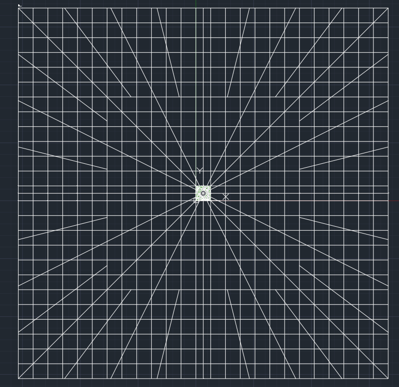
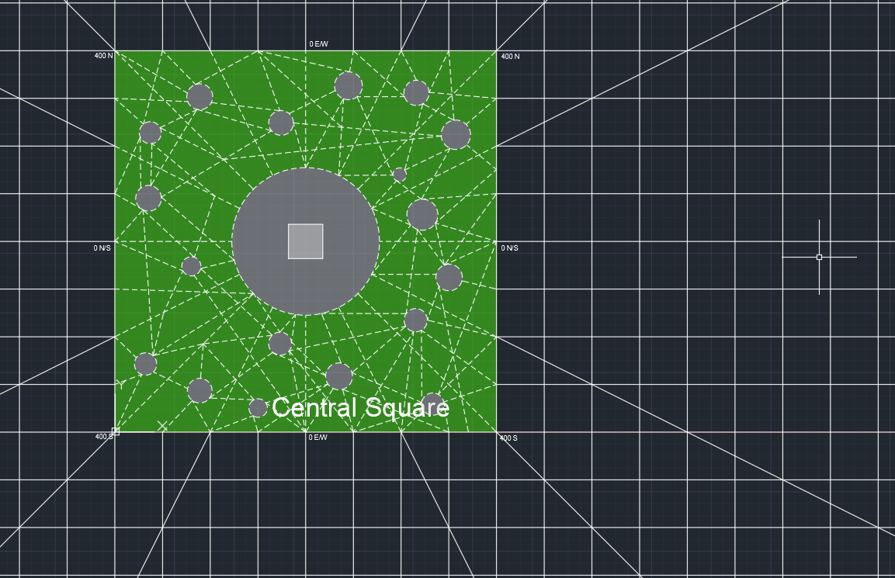

# City Map Project [Work in Progress]

The aim of this project is to apply principles of urban planning and transportation planning to create my own "ideal city". 

Progress screenshots: 

Overall city view, showing major streets. There is a grid system, where there is a major street every mile, running E/W and N/S. There are also radial major streets that allow easier diagonal travel. Exception to this rule: There are two major streets running directly N/S and E/W of the city's geographical center, which is a half-mile away from the nearest parallel major streets. 

City center view, showing some minor streets. The grid system's numbering is shown as well. Each minor block has 100 possible address numbers, with 800 numbers in a mile (each minor block is 1/8 mile). At the center of the city is a common park/gathering spot. The central circle is a large plaza, and the inner square is an elevated platform. Dashed lines indicate walking paths, and the minor circles scattered around the central square are meant to be smaller gathering spots. 

Design Log:

1. Decision 1: Overall shape
    * I considered a few different shapes for this imaginary city: concentric circles with radiating streets (like polar coordinates), a rectangular grid system (cartesian), and a city centered around a river as many are. 
    * Ultimately, this is an "ideal city". As such, it shouldn't be constrained heavily by the physical-geographical landscape, so centering it around a river would require me to "design" a river first. As such, I narrowed the choice down to circles or squares. 
    * I ended up settling on the rectangular grid. Part of this decision is my love and appreciation of Chicago, which has one of the most organized and neat city grids in the world. I also took the house numbering system from Chicago. However, I realized that areas farther from the city center had very long path lengths from a given point A to B, so I added radial streets. Initially, there were only 4 radial-diagonal streets - NE, NW, SW, SE; but I decided to add secondary diagonal streets in farther areas from the city center to further improve travel distances. [see taxicab geometry] 
2. Decision 2: City center
    * Initially, I began designing a simple "Central Park" in the city center, much like the one in Manhattan. However, 1 sq mile is not much for such a large and important park, so the whole thing would have felt mediocre. Also, it doesn't quite embody the spirit of an ideal city. It ended up that the center of the entire city was in the middle of a pond, and I tried placing baseball fields and sports courts around, but it felt inappropriate to be at the center of the park. 
    * Instead, I opted for the very center of the city to be a sort of plaza/public square (that happens to be a circle). The inner square is an elevated, permanent platform that is meant to be multi-use. It could be a speaking area for politicians, a concert stage, a protest spot, or anything else. 
    * I have yet to decide whether there is to be a monument at the center of the central square. 
    * Each little circle around it is a minor plaza, with numerous walking paths between each mini-plaza. These are meant to be gathering places for the people of the city, whether interactions occur by chance or schedule, and they are meant to help people form connections while still allowing the central square to be a greenspace. Each mini-plaza will have a monument at the center. Even though the walking paths are many, I tried to include many access points along the four sides of the central square, and the very center of the city is easily accessible via the eight main streets (N,S,E,W,NW,NE,SW,SE). 
3. Location
    * I am setting this city in some imaginary location in the United States because that's the culture and geography I'm most familiar with. This influences transit, street names, etc. 
4. Decision 3: Airport(s)
    * When planning an airport, it would be beneficial for the first city airport to be large enough to accomodate growth without needing an expansion (like MDW and ORD). As such, I was very liberal with the amount of space and runway lengths. 
    * Airside logistics. I have added 6 runways so far, which is plenty. Future additions would likely be difficult. Current decision: do I take the time to include taxiways in the drawing, or is that an unneccesary waste of time? It would make the airport look more complete though. 
    * Landside logistics. Currently in the process of designing the footprint of the passenger and cargo terminal(s), as well as the transportation access to it. 
5. Decision 4: Transit modes
    * As we know, the US' biggest urban planning downfall is that we prioritized cars over people in our infrastructure. So, does my ideal city dare to leave cars entirely out of our infrastructure? Or do we still consider that they may be used, but not primarily? This is a decision in progress. We know that public transit is often ableist and inaccessible - is the solution to make it more accessible and exclude cars, or should we still leave the option of personal vehicles for mobility-limited citizens? Also, how do we consider short-distance transport of goods? Some activities like moving require the use of a small truck or personal vehicle. Do we exclude these from our infrastructure and add alternatives? Are the alternatives even viable?
    * Traffic. One way streets, stoplights, controlled intersections, etc. 
6. Street Names
    * These names have a variety of inspirations, from cities like Chicago and others. 
    * Grid system: Each minor block is 1/8 mile, which is 660 feet. Thus, 8 blocks is a mile. In each minor block there are 100 possible address numbers, and the next block starts at the next 100. Thus, you can figure out where you are in the city based only on the grid coordinates. The normal grid streets have a direction in front of the street name, ex. N. Central Ave. This is the portion of Central Ave that runs in the north half of the city. Same applies for S, E, and W. 
    * Major East-West Streets
        * ON/S: E/W Main St
        * 400N: E/W State St
        * 400S: E/W Walnut St
        * 1200N: E/W DuSable St
        * 1200S: E/W Jacobs Ave
        * 2000N: E/W Mies van der Rohe Ave (Mies Ave)
        * 2000S: E/W Woodlawn St
        * 2800N: E/W Oakton St
        * 2800S: E/W Ida B. Wells Ave (Wells Ave)
        * 3600N: E/W Baldwin Ave
        * 3600S: E/W Sullivan St
        * 4400N: E/W Chicago Ave
        * 4400S: E/W Waters St
        * 5200N: E/W Charleston St
        * 5200S: E/W Cuyahoga Ave
        * 6000N: E/W Tubman St
        * 6000S: E/W Iselin St
        * 6800N: E/W Cambridge St
        * 6800S: E/W Detroit Ave
        * 7600N: E/W Swift St
        * 7600S: E/W Watson St
        * 8400N: E/W Commerce St
        * 8400S: E/W Irwin St
        * 9200N: E/W Peach St
        * 9200S: E/W Milwaukee Ave
        * 10000N: E/W Everett St
        * 10000S: E/W Rainier St
    * Major North-South Streets
        * 0E/W: N/S Central Ave
        * 400E: N/S Grand Ave
        * 400W: N/S Lafayette St
        * 1200E: N/S Coretta St
        * 1200W: N/S Foster St
        * 2000E: N/S Division Ave
        * 2000W: N/S Providence St
        * 2800E: N/S Gary St
        * 2800W: N/S Malcolm St
        * 3600E: N/S Park Ave
        * 3600W: N/S Stonewall St
        * 4400E: N/S Mandela St
        * 4400W: N/S College Ave
        * 5200E: N/S Newton St
        * 5200W: N/S Swanson St
        * 6000E: N/S Sunshine Ave
        * 6000W: N/S Western Ave
        * 6800E: N/S Renton St
        * 6800W: N/S Portland St
        * 7600E: N/S Canal St
        * 7600W: N/S Reed Ave
        * 8400E: N/S Chavez St
        * 8400W: N/S Rowe St
        * 9200E: N/S Pulaski Ave
        * 9200W: N/S Albany St
        * 10000E: N/S Beacon St
        * 10000W: N/S Boylston St
    * Diagonal Streets
        * Quadrant 1, 45 deg N of E: International Blvd - connects to Airport Rd
        * Quadrant 1, 27 deg N of E: Rainbow Rd
        * Quadrant 1, 63 deg N of E: Amsterdam Ave
        * Quadrant 1, 53 deg N of E: Schuylkill St
        * Quadrant 1, 37 deg N of E: Clybourne St
        * Quadrant 1, 14 deg N of E: Union Ave
        * Quadrant 1, 76 deg N of E: Sussex St
        * Quadrant 2, 14 deg N of W: Frost St
        * Quardant 2, 37 deg N of W: Village St
        * Quadrant 2, 53 deg N of W: Cypress St
        * Quadrant 2, 76 deg N of W: Logan St
        * Quadrant 2, 27 deg N of W: Carnegie St
        * Quadrant 2, 45 deg N of W: Lincoln Ave
        * Quadrant 2, 63 deg N of W: Elizabeth Cady Stanton Ave (Stanton Ave)
        * Quadrant 3, 63 deg S of W: Michigan Ave
        * Quadrant 3, 45 deg S of W: Dempster St
        * Quadrant 3, 27 deg S of W: Bedford Ave
        * Quadrant 3, 76 deg S of W: Greenpoint Ave
        * Quadrant 3, 53 deg S of W: Newark Ave
        * Quadrant 3, 37 deg S of W: Spring St
        * Quadrant 3, 14 deg S of W: Locust St
        * Quadrant 4, 14 deg S of E: Jersey Ave
        * Quadrant 4, 37 deg S of E: Branch St
        * Quadrant 4, 53 deg S of E: Lexington St
        * Quadrant 4, 76 deg S of E: Holyoke St
        * Quadrant 4, 27 deg S of E: Martin Luther King Jr. Blvd (MLK Blvd)
        * Quadrant 4, 45 deg S of E: Euclid Ave
        * Quadrant 4, 63 deg S of E: Pennsylvania Ave (Penn Ave)

<!--Street name ideas:
Camden
Chambers
Foster
Grant
Numerical
Dempster
William
Countries
Armitage
Ashland
Broadway
Monmounth
Letters
Santa Fe
Halsted
Racine
Fullerton
Belmont
Wabash
Michigan
Wisconsin

Massachusetts Ave
Luxardo
Archer
Cermak
Canal
River
Lake
Pond
North
South

Forest
Wood
Birmingham
Indianapolis
Chicago
New York
Philadelphia
St. Louis
Worcester
Reed

Division

Kansas
Missouri
Cesar Chavez

-->
Work in progress: The city map will include street and place names, land use zoning, public transit, additional parks, universities, etc. 