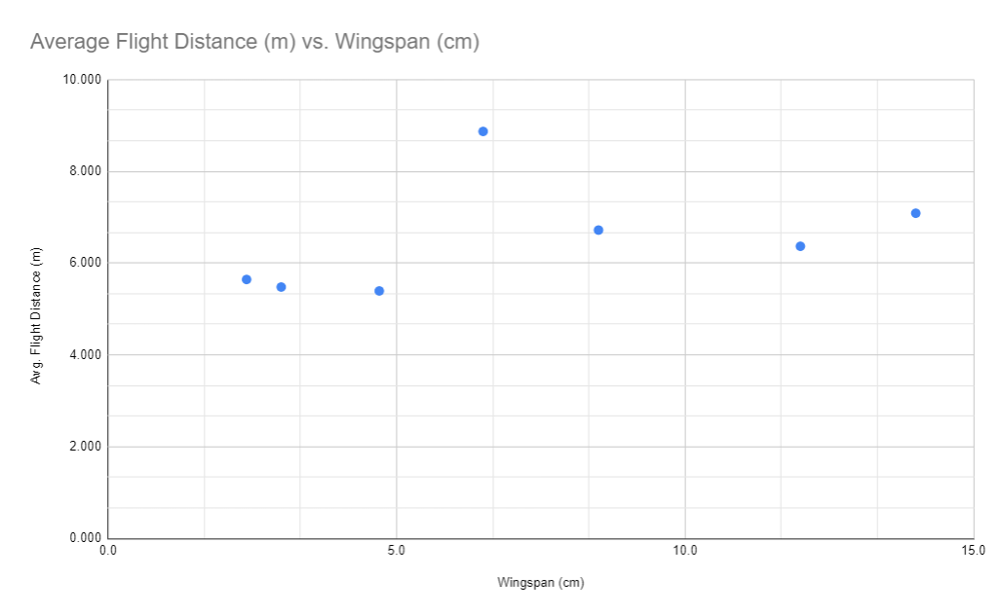

# Paper Airplane Lab

## Experimental Question

How does the size of a paper airplane affect the distance it flies?

## Hypothesis

Smaller airplanes will fly a farther distance because they have less drag on them. The typical paper airplane design does not really take advantage of lift except to prevent the airplane from falling prematurely - that is, they do not have a good glide distance. Therefore, smaller airplanes can be thrown like darts and fly farther. 

## Variables

Independent variable: airplane wingspan (cm)

Dependent variable: Flight distance (m)

Controlled variables: Paper type, throwing style, flight environment, same airplane for each wingspan trial

## Materials and Procedure

### Materials list
1. 6 sheets of paper (recycled letter 20 lb)
2. Scissors
3. Ruler
4. Pen/pencil
5. Measuring tape
6. Masking tape

### Procedure
1. Gather materials
2. Using the sheets of paper, make 7 paper airplanes, scaling down the side length of the shorter side by 1 inch each time. Mark the cuts with a ruler and pen, making sure to cut as straight as possible. Measure the largest wingspan after each airplane is constructed when the airplane sits at rest on a desk. 
    1. The paper airplane design is the typical one (diagram included). 
3. In a hallway, set the starting point with a strip of masking tape. 
4. For each airplane, do a few practice flights to get used to the flight characteristics of that size. Throw the airplane overhand with the amonut of force that maximizes the distance. 
5. For each airplane, conduct 5 recorded flights. Record the distance flown of each flight. 
6. Clean up work area
7. Analyze results

## Results

### Qualitative Observations

* Building the airplanes became progressively more difficult as they became smaller, since the folds became smaller and harder to make without crushing the paper
* The airplanes flew quite inconsistently. Sometimes they flew very straight and parabolically as intended, while at other times, they curved to the sides, hit the walls, or hit the ceiling. 
* There was so much variation in the flight lengths, in fact, that some flights were extremely short (those with erratic paths), while some flights glided very well. However, a majority of flights did not fly in a straight line. Most curved towards either wall in the hallway. 
* It wasn't immediately apparent what the effects of the hallway's air currents were on the flights, but you could definitely sense the presence of moving air in the hallway. It's likely that the hallway wind affected the flights, but since they were already so erratic, the level of influence of the wind is unknown. People walking by in the hallway, as well as the air currents generated by myself when I walked back and forth to measure distances, may also have affected the flight path of the paper airplanes. 
* I found that throwing the very small airplanes did not really have the dart-like effect I expected. My background information for this stems from a paper airplane contest we had in eighth grade, in which the glider-type airplanes, while good in theory, did not perform well because the ceilings of the hallway were too low. Rather, the winning aircraft were the dart-like ones, since the students could throw them as hard as they could. It is likely that their success had more to do with the fact that they were more carefully constructed and tuned to fly in a straight line. 

### Raw Data

| Wingspan (cm) | Distance 1 (m) | Distance 2 (m) | Distance 3 (m) | Distance 4 (m) | Distance 5 (m) |
|:-------------:|:--------------:|:--------------:|:--------------:|:--------------:|:--------------:|
|      2.4      |      6.713     |      6.183     |      3.560      |      6.958     |      4.803     |
|      3.0      |      5.878     |      5.383     |      5.463     |      7.098     |      3.570      |
|      4.7      |      6.793     |      6.488     |      1.590      |      5.138     |      6.958     |
|      6.5      |      11.420     |      6.633     |      8.493     |      9.318     |      8.483     |
|      8.5      |      4.498     |      4.353     |      11.080     |      7.098     |      6.568     |
|      12.0     |      6.488     |      5.702     |      7.223     |      6.543     |      5.878     |
|      14.0     |      6.183     |      7.873     |      7.493     |      7.493     |      6.393     |

## Analysis

### Graph

### Statistics

Table of statistical values: 
| Wingspan (cm) |  Mean | Standard Deviation | 95% Confidence Interval | Median |  IQR  |    Outliers (1.5 IQR Test)   |
|:-------------:|:-----:|:------------------:|:-----------------------:|:------:|:-----:|:----------------------------:|
|      2.4      | 5.643 |        1.170       |      {5.604, 5.682}     |  6.183 | 1.910 |             None             |
|      3.0      | 5.478 |        1.036       |      {5.444, 5.513}     |  5.463 | 0.495 |  3.57 (lower); 7.098 (upper) |
|      4.7      | 5.393 |        1.832       |      {5.332, 5.455}     |  6.488 | 1.655 |         1.590 (lower)        |
|      6.5      | 8.869 |        1.414       |      {8.822, 8.917}     |  8.493 | 0.835 | 6.633 (lower); 11.42 (upper) |
|      8.5      | 6.719 |        2.225       |      {6.645, 6.794}     |  6.568 | 2.600 |         11.08 (upper)        |
|      12.0     | 6.367 |        0.493       |      {6.350, 6.383}     |  6.488 | 0.665 |             None             |
|      14.0     | 7.087 |        0.612       |      {7.067, 7.107}     |  7.493 | 1.100 |             None             |

Calculating the least squares regression line using all of the data points yielded the equation: 

y = 5.570 + 0.111(x) with an r-squared of 0.058. 

## Conclusion and Discussion

We initially hypothesized that smaller paper airplanes would fly longer distances because of their reduced drag. However, after completing the experiment, we find that there is insufficient evidence to draw this conclusion. The data showed that there is a weakly positive association between wingspan and flight distance. However, given the slope of 0.111 and r-squared of 0.058 of the least-squares linear regression line, the data was far too spread out to draw any conclusions. Indeed, the dataset contained many outliers on either end: flights that were very short, or flights that flew for a longer distance than most other flights. Therefore, we determine that the relationship between a paper airplane's wingspan and distance flown is inconclusive. 

We identified several sources of error. First, because the flights tended not to fly in a straight line (as discussed earlier), but distances were measured along the wall, the measured distances would have been shorter than the actual distance flown. Second, a lack of available equipment made it necessary to use a nontraditional measurement method, by measuring the length of a wall and counting the number of lockers along that wall. As the number of lockers became larger, it is possible that the measurements became increasingly different from the actual distance. However, because the flights were so varied anyway, this likely did not have much of an impact. 

In future experiments, we suggest repeating this experiment with a greater sample of airplanes in order to better account for variations in build quality. We suggest conducting the experiment in a more isolted area and taking measures to avoid air currents and wind. Finally, we suggest "trimming" each aircraft before taking data so that they fly straight and consistently. 